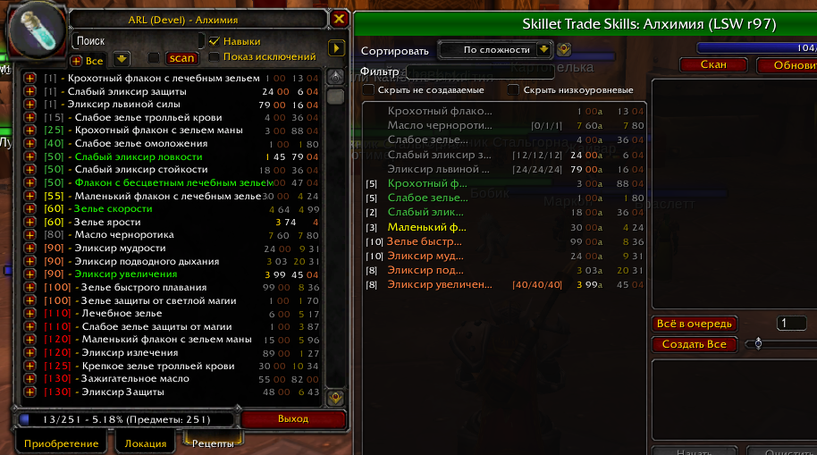

Теперь стомиость крафта видна и для неизученных рецептов в окне AckisRecipeList.

  

Показ цен рецептов (предмета и стоимость крафта) в окне профессий и мода ARL.
Измененный мод LilSparkysWorkshop https://github.com/laytya/LilSparkysWorkshop-vanilla Revision: 97 для WoW версии 3.3.5+ сервера Sirus.

  В окне рецептов мода AckisRecipeList (все рецепты, включая неизученные) v2.01 https://www.wowinterface.com/downloads/info8512-AckisRecipeList.html - работает.
  В окне профессии мода Skillet - работает.

  Запуск:
  1. Cкопировать папки LilSparkysWorkshop и AckisRecipeList в \Interface\Addons\ (в папке игры).
  2. Открыть окно ARL на вкладке "Рецепты", можно включить "показывать известные".
     Нажать кнопку "scan" для заполнения базы рецептов из АРЛ.
     Запустить один раз для каждой профессии (открывая каждую профессию и нажимая на кнопку скан).
